## Log File Analyzer API Implementation using REST and gRPC

### Author: Venkata Sesha Phani, Vakicherla
### Email: phani.vakicherla@gmail.com

### Introduction

The goal of this project is to gain experience with solving a distributed computational problem using cloud computing technologies by designing and implementing a RESTful service and a lambda function that are accessed from clients using gRPC.

Video Link : https://youtu.be/vow7hjhuf80

The video explains how different cloud components are used to solve the log files data analyzing problem and deployed a restful API service in AWS.I also explained the steps and different components involved in deploying this solution in AWS.

### Environment

```   
OS: Ubuntu

IDE: IntelliJ IDEA 2022.2.3 (Ultimate Edition)

SCALA Version: 3.2.0

SBT Version: 1.7.1

JDK Version: 11.0.16

Python Version: 3.9
```
Note: Python is used for deploying Lambda function in AWS.

### Running the project


1) Clone this repository and cd into the repository
```
git clone https://github.com/SeshaPhaniVV/LogAnalyzer-grpc-rest-api
cd LogAnalyzer-grpc-rest-api
```

2) Download and Install and the dependencies i. Java Development Kit
   1. Java Development Kit
   2. SBT 

3) Compile the scala code and install all the required packages using below command
````
sbt clean compile
````

4) After compilation please execute the following command to start the execution of project.

```
sbt run
```
5) Once the `run` command is executed in the terminal, below output should be visible. 
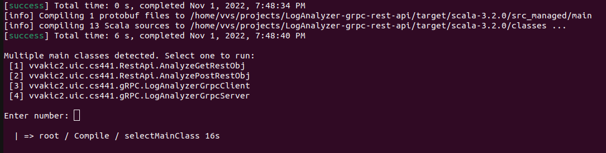

5) The project contains two API implementations.
   1. gRPC:
   To run the gRPC implementation, first choose option to execute LogAnalyzerGrpcServer to start the server.
   Open another terminal, run the same command `sbt run` and choose option to start the execution LogAnalyzerGrpcClient to start the execution of client.
   2. RestApi:
   HTTP Get request and HTTP Post request API Functionalities are implemented. 
   To run the Get Request implementation, please choose option to execute AnalyzeGetRestObj
   To run the Post Request implementation, please choose option to execute AnalyzePostRestObj

### Running the test file

Test Files can be found under the directory /src/test/scala/LogAnalyzerApiTestCases

````
sbt clean compile test
````
Output of the test runner:
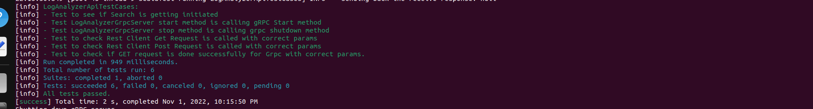

### Project Implementation Details

Cloud Architecture diagram of the deployment of this project:
   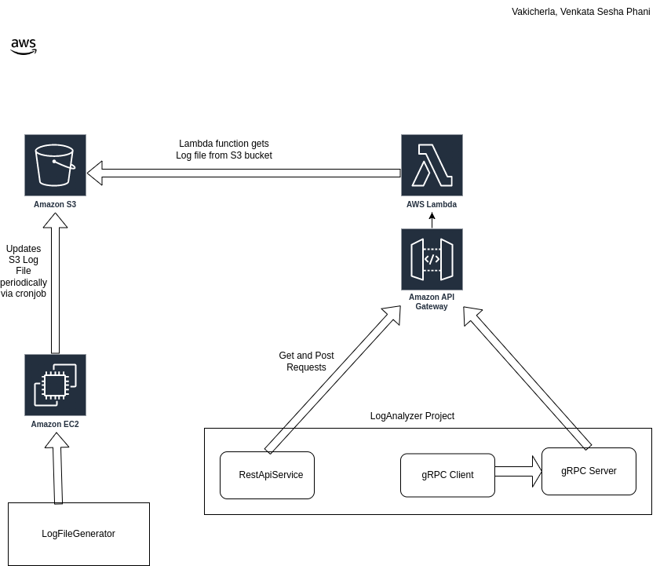

### Functionality of Periodic Updates of S3 `LogFileGenerator.log` file via EC2 instance 
   Code to the LogFileGenerator is in this repo: https://github.com/SeshaPhaniVV/LogFileGenerator
   The LogFileGenerator written in scala runs periodically via cron job in EC2 instance and updates the S3 file.
   Functionality:
   1. LogFileGenerator creates a log file of 100 records(customizable) and creates a file in log/LogFileGenerator.log
   2. For every cron job run the changes are **appended** to the same LogFileGenerator.log file.
   3. We created a jar file using `sbt clean compile assembly` from the LogFileGenerator project
   4. The generated jar file is `LogFileGenerator-assembly-1.jar`. Uploaded this jar file into EC2 instance via sftp. 
      `sftp -i <pem_key>.pem ec2-user@<ec2-ip>.compute-1.amazonaws.com` and `put LogFileGenerator-assembly-1.jar`
   5. This jar file depends on external jar files hence we have uploaded the external jar files as well.  
   6. Then we created a shell script that does execute the jar files generates logs and uploads it into S3. This shell script will be periodically executed by cron job. 
   7. 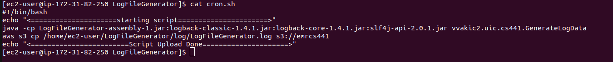[LogsS3UpdateScript.sh](utils/LogsS3UpdateScript.sh)
   8. Thus `LogFileGenerator.log` S3 file is updated periodically via cron from EC2 instance. 
   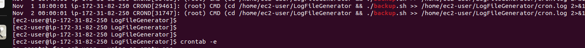

### Functionality of Lambda Function and API Gateway
   **Lambda Function**:
      Lambda Function written in python accesses the S3 LogGenerator.log File and performs the binary search over those logs. 
      Given the time, date, delta and pattern it gets all the logs in the given timeframe and which matches the logs.
      Code is available in [utils/LambdaLogsAnalyzer.py](utils/LambdaLogsAnalyzer.py)

   **Api Gateway**:
      API Gateway acts as a trigger for the execution of Lambda Function.
      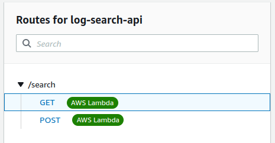

   Postman Requests for the API Gateway are below:
      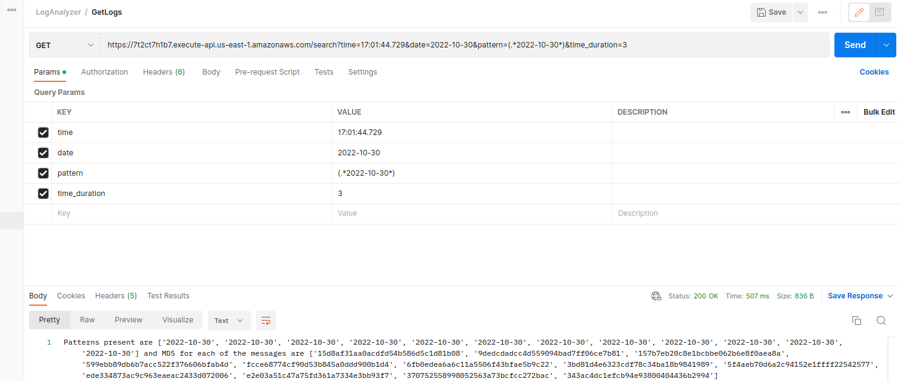
      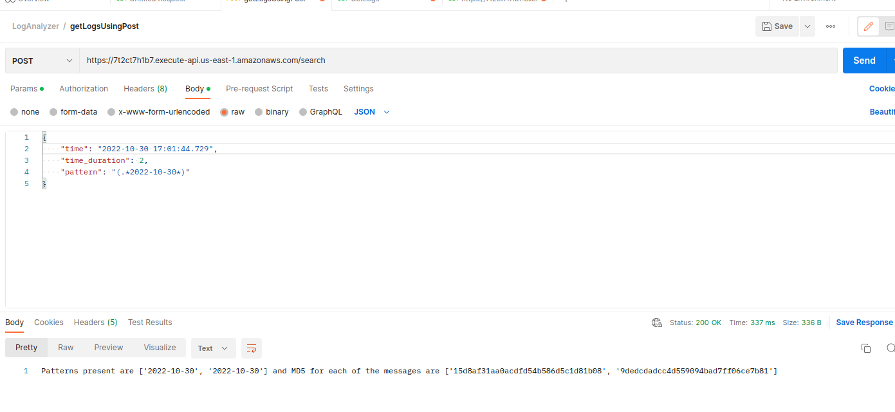

### gRPC Implementation
[LogAnalyzerService.proto](src/main/protobuf/LogAnalyzerService.proto) contains the structure for a protobuf to be used for gRPC request.

ScalaPB package will use the .proto file to create the stubs which can be used to create gRPC Client/Server and facilitate the interaction between them. Files will be created in /target/scala folder.

Execution of gRPC server and client and explained above under Running the project section. Please refer that.

Output of the data is below:
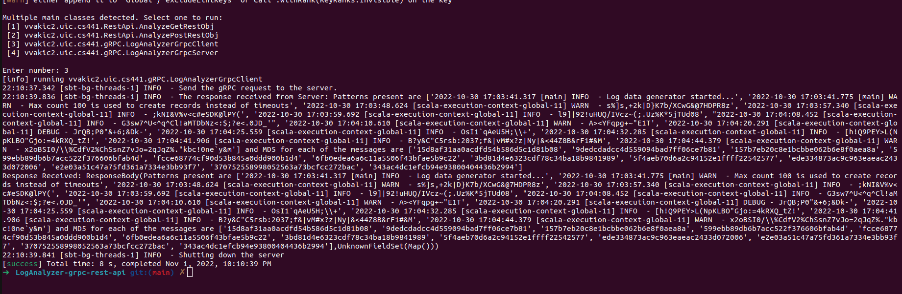

### RestAPI Implementation
Used Apache HTTP to make API calls. Implemented two main class `AnalyzeGetRestObj` and `AnalyzePostRestObj` to make Get and Post requests to the API Gateway.

Execution of RestApi is explained above under Running the project section. Please refer that.

Output for Get Request:
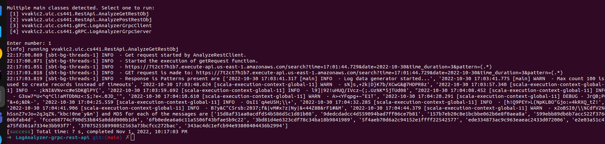

Output for Post Request
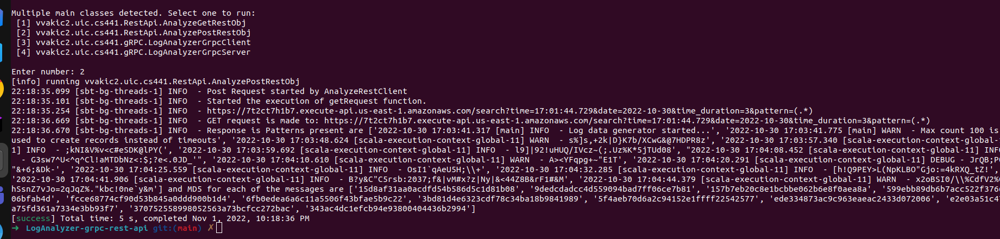

### NOTE: AWS EMR Cluster Implementation
## [Documentation](https://github.com/SeshaPhaniVV/LogAnalyzer/blob/main/README.md)


Please contact me in case of any queries: `phani.vakicherla@gmail.com`
